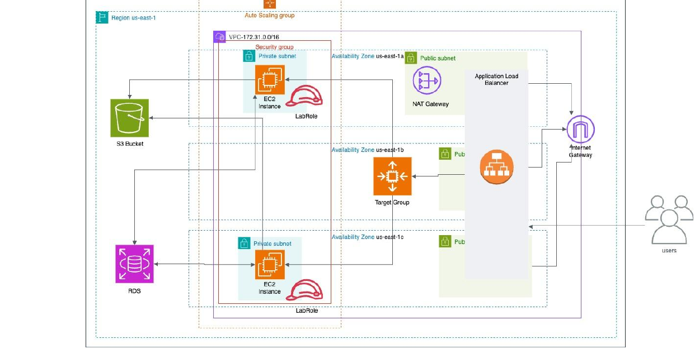
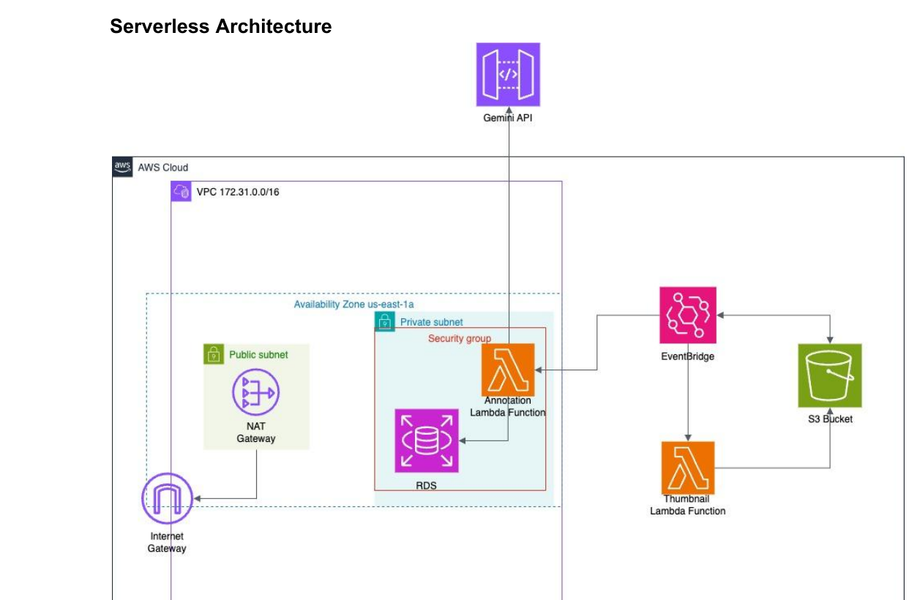

# Image Caption & Thumbnail Pipeline on AWS

A serverless-augmented image upload and auto-captioning app: users upload an
image through a web UI, and two event-driven AWS Lambda functions
automatically generate an AI caption (via the Gemini API) and a thumbnail —
all without the web application blocking on either task.

This was originally built and deployed as a solo cloud architecture project
using an AWS training sandbox environment, and is preserved here as an
architecture case study and code sample. The live AWS deployment is no
longer running (see [Status](#status) below).

## Why this design

The interesting part of this project isn't the image captioning itself —
it's the architecture decisions around making a traditional web app scale
elastically and offload slow, non-blocking work to serverless functions:

- **Auto Scaling Group + Application Load Balancer** — the Flask app runs
  behind an ALB with EC2 instances in an Auto Scaling Group, so it can
  handle traffic spikes by launching additional instances and scale back
  down when load drops.
- **EventBridge instead of a direct S3 trigger** — AWS does not allow two
  Lambda functions to be attached to the same S3 `PUT` event trigger
  directly. Routing the S3 upload event through an EventBridge rule
  (filtered on the `uploads/` prefix) allows both the captioning function
  and the thumbnail function to fire independently from the same upload
  event.
- **Private subnets for compute, public subnet only for the load balancer**
  — EC2 instances and the RDS database sit in private subnets with no
  direct internet exposure; only the ALB is internet-facing, and outbound
  access from private subnets goes through a NAT Gateway.
- **Least-exposure security groups** — the database security group only
  accepts MySQL traffic from the application's security group, not from
  the public internet.

## Architecture

**Web application layer**



**Serverless / event-driven layer**



**Flow:** user uploads an image → Flask app writes it to S3 under
`uploads/` → an EventBridge rule (filtered on that prefix) fires two
Lambda functions in parallel → the annotation function calls the Gemini
API and writes the caption to RDS, while the thumbnail function resizes
the image and writes it back to `uploads/thumbnails/` → the gallery page
reads both the caption and the thumbnail from S3/RDS.

## Testing & CI

The Flask app has a small pytest suite (`web-app/tests/`) covering file-type
validation and the upload/gallery routes, with S3, RDS, and the Gemini API
mocked out so tests run without any real credentials. A GitHub Actions
workflow (`.github/workflows/ci.yml`) runs this test suite and validates
the Terraform configuration (`terraform fmt` + `terraform validate`) on
every push.

```
cd web-app
pip install -r requirements-dev.txt
pytest tests/ -v
```

## Repo structure

```
web-app/            Flask application (upload form + gallery page) + tests
lambda-annotation/  Lambda function: calls Gemini API, writes caption to RDS
lambda-thumbnail/   Lambda function: generates and stores thumbnails
infra/              Terraform (retrospective — see infra/README.md for status)
docs/                Architecture diagrams
.github/workflows/   CI: runs tests + validates Terraform on every push
```

## Load testing / Auto Scaling verification

The Auto Scaling Group was load tested with ApacheBench (30,000 requests,
60 concurrent connections, targeting the `/gallery` endpoint through the
ALB). The group scaled out from 1 to 3 healthy instances as CPU utilization
rose above the target tracking threshold, and scaled back in to 1 instance
once load dropped — confirming the ALB health checks and target group
registration were both working correctly end-to-end.

## A real debugging story

The thumbnail function uses Pillow for image resizing, which depends on
native (compiled) libraries. Deployed as a plain zip file, it failed
repeatedly with `ImportError: cannot import name '_imaging' from 'PIL'` —
Pillow's compiled components weren't compatible with the Lambda execution
environment. After trying to build a compatible layer manually without
success, the fix was to attach a prebuilt public Lambda Layer (from the
community-maintained [Klayers](https://github.com/keithrozario/Klayers)
project) matching the target region and Python runtime version.

## Known limitations / what I'd do differently

- **The original deployment was manual; Terraform in `infra/` was written
  retrospectively.** The original click-ops deployment worked, but wasn't
  reproducible or version-controlled. The Terraform config in `infra/`
  documents that architecture as code — see `infra/README.md` for its
  current status (it hasn't been re-applied against a live account).
- **Broad IAM role.** The sandbox environment's built-in role was used for
  EC2 and Lambda permissions. A production deployment would use scoped,
  least-privilege IAM policies instead.
- **`debug=True` in the Flask app.** Fine for local development, but this
  should be disabled (and served via a proper WSGI server like Gunicorn)
  in any real deployment, since it leaks stack traces on errors.
- **Image MIME type is hardcoded to `image/jpeg`** when sending images to
  the Gemini API, even though the app accepts PNG/GIF uploads too — this
  would misclassify non-JPEG uploads and is worth fixing.

## Status

The AWS resources for this project (EC2, RDS, S3, Lambda) were provisioned
in a time-limited training sandbox and are no longer active, so there is no
live demo link. The code and architecture diagrams here reflect the working
deployment; the report artifacts (CloudWatch metrics, Auto Scaling activity
logs, ApacheBench output) that verified the system's behavior in production
are summarized above.

## Tech stack

Python, Flask, AWS (EC2, Auto Scaling, ALB, S3, RDS/MySQL, Lambda,
EventBridge, IAM), Google Gemini API, Pillow
